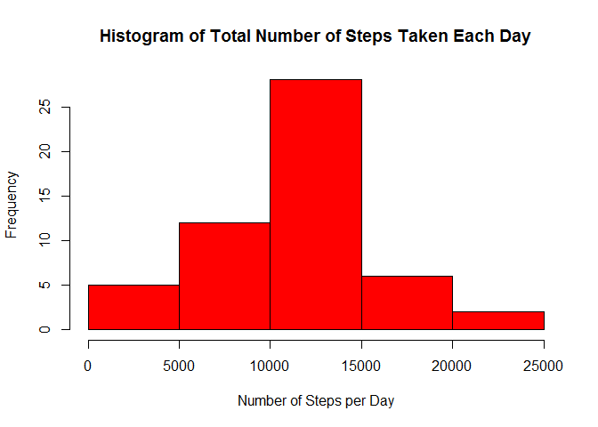
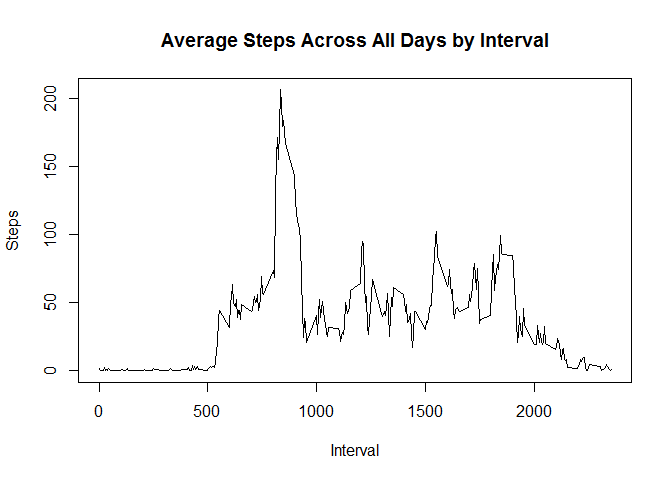
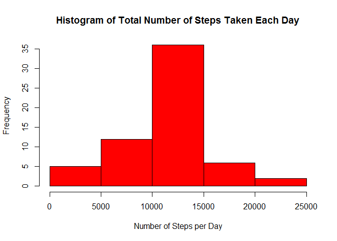
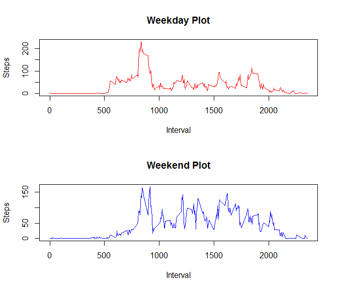

# RR course project 1
xxxx  
Tuesday, July 14, 2015  


##Loading and preprocessing the data

```r
#The file has already been downloaded. So, in order to prevent re-downloading, the relevant code is omitted.
data <- read.csv("activity.csv")
df <- tbl_df(data)
head(df); tail(df); dim(df); str(df)
```

```
## Source: local data frame [6 x 3]
## 
##   steps       date interval
## 1    NA 2012-10-01        0
## 2    NA 2012-10-01        5
## 3    NA 2012-10-01       10
## 4    NA 2012-10-01       15
## 5    NA 2012-10-01       20
## 6    NA 2012-10-01       25
```

```
## Source: local data frame [6 x 3]
## 
##   steps       date interval
## 1    NA 2012-11-30     2330
## 2    NA 2012-11-30     2335
## 3    NA 2012-11-30     2340
## 4    NA 2012-11-30     2345
## 5    NA 2012-11-30     2350
## 6    NA 2012-11-30     2355
```

```
## [1] 17568     3
```

```
## Classes 'tbl_df', 'tbl' and 'data.frame':	17568 obs. of  3 variables:
##  $ steps   : int  NA NA NA NA NA NA NA NA NA NA ...
##  $ date    : Factor w/ 61 levels "2012-10-01","2012-10-02",..: 1 1 1 1 1 1 1 1 1 1 ...
##  $ interval: int  0 5 10 15 20 25 30 35 40 45 ...
```

##What is mean total number of steps taken per day?

```r
#by_date <- group_by(df, date) #grouping data frame by day
#steps_pd <- summarize(by_date, daily_sum=sum(steps))
steps_pd <- aggregate(steps ~ date, df, FUN="sum")
hist(steps_pd$steps, col="red", main="Histogram of Total Number of Steps Taken Each Day", xlab="Number of Steps per Day")
```

 

```r
mean_steps_pd <- mean(steps_pd$steps) #mean of total number of steps per day
med_steps_pd <- median(steps_pd$steps) #median of total number of steps per day
```
* The mean of steps taken per day is 10766.19.
* The median of steps taken per day is 10765.

##What is the average daily activity pattern?

```r
steps_pi <- aggregate(steps ~ interval, df, FUN="mean")
plot(steps_pi$interval, steps_pi$steps, type="l", main="Average Steps Across All Days by Interval", ylab="Steps", xlab="Interval") #Time series plot of the 5-minute interval (x-axis)
```

 

```r
max_value <- steps_pi[which.max(steps_pi$steps), "interval"]
```
* Interval 835 contains the maximum number of steps on average across all the days in the dataset.

##Imputing missing values

```r
no_miss <- sum(is.na(df))
df2 <- df #new data frame
#New strategy for filling in all of the missing values in the dataset using mean of 5-minute interval of all days
for (row in 1:nrow(df2)) {
    if (is.na(df2$steps[row])) df2$steps[row] <- steps_pi[which(df2$interval[row]==steps_pi$interval),"steps"] 
}

steps_pd2 <- aggregate(steps ~ date, df2, FUN="sum")
hist(steps_pd2$steps, col="red", main="Histogram of Total Number of Steps Taken Each Day", xlab="Number of Steps per Day")
```

 

```r
new_mean_steps_pd <- mean(steps_pd2$steps)
new_med_steps_pd <- median(steps_pd2$steps)
```
* The total number of missing values in the dataset is 2304.

* In the first data frame, the mean was 10766.19 and in the new data frame the mean is 10766.19.

* In the first data frame, the median was 10765 and in the new data frame the median is 10766.19.

##Are there differences in activity patterns between weekdays and weekends?

```r
weekday <- c("Mon", "Tues", "Wed", "Thurs", "Fri")
weekend <- c("Sat", "Sun")
for (row in 1:nrow(df2)) {
    if (is.element(wday(df2$date[row], label=TRUE), weekday)) df2$dtype[row] <- "weekday"
    else if (is.element(wday(df2$date[row], label=TRUE), weekend)) df2$dtype[row] <- "weekend"
    else df2$dtype[row] <- "error"
}
df2$dtype <- as.factor(df2$dtype)
steps_pi3 <- aggregate(steps ~ interval + dtype, df2, FUN="mean")
df2_wd <- subset(steps_pi3, dtype=="weekday")
df2_we <- subset(steps_pi3, dtype=="weekend")
par(mfrow = c(2,1))
plot(df2_wd$interval, df2_wd$steps, type="l", main="Weekday Plot", ylab="Steps", xlab="Interval", col="red")
plot(df2_we$interval, df2_we$steps, type="l", main="Weekend Plot", ylab="Steps", xlab="Interval", col="blue")
```

 
